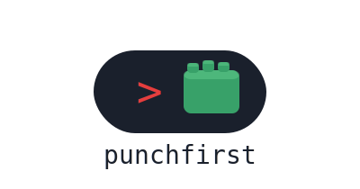

                          

# punchfirst

*The test throws the first punch. Always.*

---

You ask for a function. The agent writes it. It works — until it doesn't. No test, no contract, no edge cases. The first bug ships with the feature.

punchfirst loads a strict TDD enforcer and test architect into your AI agent. Tests before code. Behavior over internals. Green before refactor.

## Before / after

You ask for a user lookup. The agent writes something that handles the happy path. Maybe returns `None` for missing IDs, maybe not. You don't know until production.

With punchfirst, you provide the spec first:

```
get_user(user_id: int) -> User | None
Returns the user with the given ID.
Returns None if no user exists.
Raises ValueError if user_id is None or not a positive integer.
```

punchfirst reads the spec, derives the test cases, writes them all failing, then writes the code:

```python
# All tests written first — RED

def test_get_user_returns_user_for_valid_id():
    user = create_user(name="AJ")
    assert get_user(user.id).name == "AJ"

def test_get_user_returns_none_for_unknown_id():
    assert get_user(99999) is None

@pytest.mark.parametrize("bad_id", [None, 0, -1])
def test_get_user_raises_for_invalid_id(bad_id):
    with pytest.raises(ValueError):
        get_user(bad_id)

# Only then — minimum code to pass:

def get_user(user_id: int) -> User | None:
    if not isinstance(user_id, int) or user_id <= 0:
        raise ValueError(f"user_id must be a positive integer, got {user_id!r}")
    return db.query(User).filter_by(id=user_id).first()
```

More in [`examples/`](examples/).

## How it works

punchfirst starts from a spec — not from a vague request. Give it a docstring, an OpenAPI spec, a markdown requirements doc, a user story, or a function signature with type hints. It reads the spec, derives the complete list of test cases, writes them all as failing tests, then writes the minimum code to pass.

The full flow:

```
0. Read the spec → extract behaviors, inputs, outputs, error cases
   → if no spec, ask before writing anything
1. Is there a failing test for this?          → no test = no code
2. Does the test test behavior, not internals? → rewrite the test first
3. Is this the smallest test that proves it?   → shrink it
4. Does the name describe the scenario?        → rename it
5. Only then: write the minimum code to pass
6. Refactor — only when green
```

The test architect layer applies to every test written or reviewed:

- Public interfaces only — never `._private_method()` in tests
- One behavior per test — "and" in the name means split it
- Names read like specs: `test_login_with_expired_token_raises_auth_error`
- Edge cases always: `None`, empty, boundaries, error paths
- `@pytest.mark.parametrize` before duplicating tests
- Mock only external services and I/O — never your own classes
- Delete tests that assert on implementation details

Security tests, data mutation tests, error handling tests, and API contract tests are never removed.

## SE principles

punchfirst enforces a set of SE principles through the test lens — things tests can actually surface:

- **YAGNI**: no failing test = don't build it
- **SRP**: complex test setup for one function = that function does too much
- **DIP**: can't inject a dependency = can't test it; all external deps must be injectable
- **Fail fast**: every function with inputs needs error path tests
- **DRY** (tests): parametrize before copy-pasting
- **DRY** (production): tests don't always catch it — identical test clusters are the signal
- **KISS**: hard-to-write test = design problem, not test problem

## Install

### Claude Code / Cowork

```
/plugin marketplace add ananyajoshi0203-cpu/punchfirst
/plugin install punchfirst@punchfirst
```

Active every session once installed.

`/punchfirst-review` — scan diff for untested production code, returns test skeletons.  
`/punchfirst-audit` — find tests that test internals, duplicate instead of parametrize, or assert nothing real.  
`/punchfirst ultra` — full sweep: untested code + bad tests + coverage gaps + fixture bloat.  
`/punchfirst-help` — protocol and commands.

### Gemini CLI / Antigravity CLI

```
gemini extensions install https://github.com/ananyajoshi0203-cpu/punchfirst
```

### Kiro

Copy `.kiro/steering/punchfirst.md` to `~/.kiro/steering/` (global) or `.kiro/steering/` in your project.

### OpenCode

OpenCode auto-loads `AGENTS.md` from the repo root. Run OpenCode from a checkout of this repo, or copy `AGENTS.md` to your project.

## Other tools

| Tool | File |
|---|---|
| Cursor | [`.cursor/rules/punchfirst.mdc`](.cursor/rules/punchfirst.mdc) |
| Windsurf | [`.windsurf/rules/punchfirst.md`](.windsurf/rules/punchfirst.md) |
| Cline | [`.clinerules/punchfirst.md`](.clinerules/punchfirst.md) |
| GitHub Copilot | [`.github/copilot-instructions.md`](.github/copilot-instructions.md) |
| Kiro | [`.kiro/steering/punchfirst.md`](.kiro/steering/punchfirst.md) |
| Gemini CLI / Antigravity CLI | [`gemini-extension.json`](gemini-extension.json) |
| OpenCode | [`opencode.json`](opencode.json) + [`AGENTS.md`](AGENTS.md) |
| OpenAI Codex / general agents | [`AGENTS.md`](AGENTS.md) |

## FAQ

**Does it need config?** No.

**What if I need to move fast without a test?** punchfirst will write the test skeleton — it takes less time than explaining why you skipped it.

**What if the test is hard to write?** That's the design telling you something. Hard to test = hard to reason about. Fix the design.

**Python only?** Examples use Python/pytest. The protocol is language-agnostic — adapter rules cover Cursor, Windsurf, Copilot, and others.

**Why "punchfirst"?** The test goes first. It fails before the code exists. The failure is the starting point.

## Numbers

*See [`benchmarks/`](benchmarks/) — in progress. Contribute your own.*

## License

MIT.
